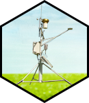

# cimir: Interface to CIMIS 

<!-- badges: start -->

<!-- badges: end -->

This package provides an R interface to the 
[California Irrigation Management Information System](https://cimis.water.ca.gov/)
(CIMIS) [Web API](http://et.water.ca.gov/Home/Index). In order to use 
this package, you will need to 
[create a CIMIS account](https://cimis.water.ca.gov/Auth/Register.aspx) 
and [request a web services AppKey](https://et.water.ca.gov/Home/Register/). 
Browse the documentation at 
[mkoohafkan.github.io/cimir](https://mkoohafkan.github.io/cimir/).
